# LCD Alarm Clock — UI & Component Design Specification

**v3.0 · LVGL Reference**

---

## 1. Overview

This document is the single source of truth for the LCD alarm clock UI. It covers hardware requirements, design tokens, a reusable component library, screen-by-screen composition, and the full state machine.

The device has no touch screen. All interaction is driven by physical buttons and a slide switch. The visual language is inspired by phosphor green VFD displays: high contrast, near-black background, minimal chrome.

### 1.1 Modularity Principles

- Every visual element maps to exactly one named component.
- Components own their own padding, border, and typography — callers only set slot content.
- State variants (idle, editing, armed, disabled) are properties of components, not separate components.
- TopBar and BottomBar are permanent — mounted once, never hidden or recreated.

### 1.2 Screen Structure

Every screen follows the same shell. Switching screens means changing ContentPanel slot contents only.

| Slot | Content |
|------|---------|
| TopBar | Always visible — date, wifi indicator, mode badge |
| ContentPanel | Variable — ContentPanelHeader / Body / Widget / Footer slots |
| BottomBar | Always visible — StatusStrip only (weather + now-playing) |

### 1.3 Pseudo-structure

```jsx
<TopBar />
<ContentPanel>
  <ContentPanelHeader>{label | nil}</ContentPanelHeader>
  <ContentPanelBody>
    <ClockDisplay blink={on|off} />
  </ContentPanelBody>
  <ContentPanelWidget>
    <DayRow activeDay={...} />  {/* nil on most screens */}
  </ContentPanelWidget>
  <ContentPanelFooter>{hint | alarm | dismiss}</ContentPanelFooter>
</ContentPanel>
<BottomBar />
```

---

## 2. Hardware & Screen

### 2.1 Recommended Screen

3.5"–4.0" IPS LCD, 480×320 px landscape.

### 2.2 Button Map

| Button | Location | Function |
|--------|----------|----------|
| **MON–SUN (×7)** | Front | Select/switch active day in auto alarm edit. Press current selected day to toggle armed/disarmed. |
| **TIME** | Top | Enter clock time edit mode. Press again to confirm. |
| **HR+** | Top | Increment hour. Active during EDIT_CLOCK, SET_SINGLE, SET_AUTO_EDIT. |
| **MIN+** | Top | Increment minute. Same context sensitivity as HR+. |
| **SET** | Top | Start alarm set flow. Press again to confirm. Behaviour depends on mode. |
| **DISMISS** | Top (large) | Dismiss firing alarm immediately. |
| **MODE switch** | Side | SINGLE \| AUTO — changes active alarm mode. |
| **PREV / PLAY / SKIP** | Side | Spotify media controls. |

---

## 3. Design Tokens

### 3.1 Colors

| Swatch | Hex | Token | Usage |
|--------|-----|-------|-------|
| | `#0A0C0F` | **Background** | Screen background — all screens |
| | `#0D1117` | **Surface** | Card / tile backgrounds |
| | `#1AFF8C` | **Primary Green** | Active digits, selected states, armed indicator |
| | `#0E8A4A` | **Mid Green** | AM/PM label |
| | `#0E6A3A` | **Dim Green** | Colon, status text, context labels, hint keywords |
| | `#1A3A28` | **Border Active** | Armed tile border, selected state |
| | `#1A2520` | **Border Default** | Default tile / card borders |
| | `#2A5040` | **Muted Text** | Date label, captions |
| | `#1A7A4A` | **Status Text** | Weather and track labels |
| | `#1A4030` | **Hint Text** | Footer hint text |
| | `#F09595` | **Alert Red** | Firing alert header |
| | `#EF9F27` | **Amber** | Dismiss footer text |
| | `#854F0B` | **Amber Dim** | Disabled hint text in header |

### 3.2 Typography

| Token | Value |
|-------|-------|
| `--dvsmb-xl` | DejaVu Sans Mono Bold 88px — ClockDisplay idle |
| `--dvsmb-lg` | DejaVu Sans Mono Bold 82px — ClockDisplay edit / firing |
| `--dvsmb-md` | DejaVu Sans Mono Bold 20px — ContentPanelHeader alert style |
| `--dvsm-xs` | DejaVu Sans Mono 9px — DayTile labels |
| `--dvsmb-ampm` | DejaVu Sans Mono Bold 17px — AM/PM superscript |
| `--dvsm-md` | DejaVu Sans Mono 11px — StatusStrip, DateLabel |
| `--dvsm-sm` | DejaVu Sans Mono 10px — ContentPanelFooter hints |
| `--dvsm-xs` | DejaVu Sans Mono 9px — ModeBadge, DayTile times, CPHeader hint suffix |

### 3.3 Spacing

| Token | Value |
|-------|-------|
| `--screen-pad-h` | 22px left/right |
| `--screen-pad-v-top` | 16px top |
| `--screen-pad-v-bot` | 14px bottom |
| `--strip-pad` | 5–6px vertical (status strip) |
| `--tile-gap` | 5px between DayTiles |
| `--tile-pad` | 6–8px top/bottom · 6–8px left/right (DayTile) |

### 3.4 Style Application Rules

Apply these properties precisely. No additional effects (shadow, gradient, glow, outline) unless visible in reference images.

| Element / State | Exact Style Values |
|-----------------|-------------------|
| ClockDisplay — idle | DejaVu Sans Mono Bold 88px · `#1AFF8C` · letter-spacing −3px · centered · colon `#0E6A3A` |
| ClockDisplay — edit/firing | DejaVu Sans Mono Bold 82px · `#1AFF8C` · entire `lv_obj` opacity blinks 1.0↔0.25 at 500ms |
| ClockDisplay — disarmed edit | Same as edit · base opacity reduced to ~0.3 (disarmed day selected) |
| AM/PM superscript | DejaVu Sans Mono Bold 17px · `#0E8A4A` · vertical-align super · margin-left 5px |
| CPHeader — normal | DejaVu Sans Mono 11px · `#0E6A3A` · tracking 0.18em · centered · padding 4px top 2px bot |
| CPHeader — alert (FIRING) | DejaVu Sans Mono Bold 20px · `#F09595` · tracking 0.08em · centered |
| CPHeader hint suffix | DejaVu Sans Mono 9px · `#1A4030` (armed) or `#854F0B` (disarmed) · appended after day label |
| CPFooter — hint | DejaVu Sans Mono 10px · `#1E4030` · centered · keyword spans `#0E6A3A` |
| CPFooter — alarm | DejaVu Sans Mono 11px · label `#1A7A4A` · time `#1AFF8C` · armed dot 6×6px `#1AFF8C` |
| CPFooter — dismiss | DejaVu Sans Mono 11px · `#EF9F27` · tracking 0.12em · centered · no border |
| DayTile — default | bg `#0D1117` · border 0.5px `#1A2520` · label `#2A4535` · time `#1E3A2A` · pip `#1A2A20` |
| DayTile — has-alarm | bg `#0D1510` · border 0.5px `#1A3A28` · label/time/pip `#0E6A3A` |
| DayTile — selected armed | bg `#0A1F10` · border 0.5px `#1AFF8C` · label/time `#1AFF8C` · pip `#1AFF8C` · clock blinks |
| DayTile — selected disarmed | Same as selected armed + `lv_obj` opacity 45% · pip `#1A2A20` |
| StatusStrip borders | 0.5px solid `#111A14` top and bottom |
| StatusStrip divider | 0.5px solid `#1A2A20` · height 13px · vertically centered |
| ModeBadge — SINGLE | text `#888780` · bg `#1A1A18` · border 0.5px `#2A2A28` · border-radius 4px |
| ModeBadge — AUTO | text `#1AFF8C` · bg `#0D1A12` · border 0.5px `#1A4028` · border-radius 4px |

### 3.5 Text Formatting Rules

Exact string formats for all dynamic UI text. Implement these precisely to avoid implementation-defined variations.

| Element | Format |
|---------|--------|
| DateLabel | `'TUESDAY · MARCH 17 · 2026'` — uppercase weekday · middot separators (·) · 4-digit year |
| CPFooter alarm — SINGLE | `'alarm 6:30 AM armed'` — no leading zero on hour |
| CPFooter alarm — AUTO | `'next alarm WED 7:15 AM'` — 3-char uppercase day · 12-hour no leading zero |
| CPFooter — no alarm set | nil text — footer hidden entirely (`LV_OBJ_FLAG_HIDDEN`) when no alarm is configured and none are armed |
| CPHeader auto edit — armed | `'— MON ● —'` — em-dashes · spaces · filled circle U+25CF |
| CPHeader auto edit — disarmed | `'— MON ○ —'` — em-dashes · spaces · empty circle U+25CB |
| CPHeader hint — armed | `'press again to disable'` — DejaVu Sans Mono 9px `#1A4030` |
| CPHeader hint — disarmed | `'disabled · press again to enable'` — `#854F0B` |
| StatusStrip weather | `'☀ 72°F Clear'` — Unicode sun U+2600 · degree symbol · condition word |
| StatusStrip track | `'♫ Track Name · Artist ‖'` — U+266B · separator · U+2016 pause |
| StatusStrip truncation | Truncate with `…` if track or artist exceeds ~140px at 11px font |
| DayTile time — set | `'6:30'` — no leading zero on hour · colon separator |
| DayTile time — unset | `'——'` — two em-dashes U+2014 |

---

## 4. Component Library

9 components cover the entire UI. Each is an `lv_obj` subtree created once and reconfigured across screens.

### C01 · TopBar

Permanent header. Never hidden.

| Property | Value |
|----------|-------|
| Height | 28px |
| Children | C07 DateLabel (flex:1) + C09 WiFiIndicator + C08 ModeBadge |
| LVGL | `lv_obj`, `LV_LAYOUT_FLEX`, `LV_FLEX_FLOW_ROW`, fixed top |

*Used in: ALL screens*

### C02 · ContentPanel + Sub-components

Variable main area. Four named sub-components as slots. The panel itself is permanent — only slot content changes.

| Property | Value |
|----------|-------|
| Layout | flex column, flex:1 |
| Sub-components | C02a–d below |
| LVGL | `lv_obj`, `LV_LAYOUT_FLEX`, `LV_FLEX_FLOW_COLUMN` |

*Used in: ALL screens*

#### C02a · ContentPanelHeader

Context label or alert heading. Hidden on idle screens.

| Property | Value |
|----------|-------|
| Normal style | DejaVu Sans Mono 11px, `#0E6A3A`, tracking 0.18em, centered |
| Alert style | DejaVu Sans Mono Bold 20px, `#F09595`, tracking 0.08em, centered |
| Hint suffix | DejaVu Sans Mono 9px — appended after label; `#1A4030` (normal) or `#854F0B` (disabled) |
| Armed indicator | `'●'` (filled, `#1AFF8C`) or `'○'` (empty) appended to day name when in auto edit |
| Hidden | `LV_OBJ_FLAG_HIDDEN` when nil |

*Used in: EDIT_CLOCK, SET_SINGLE, SET_AUTO_EDIT, FIRING*

#### C02b · ContentPanelBody

Always-visible center slot. Holds ClockDisplay and expands to fill remaining vertical space.

| Property | Value |
|----------|-------|
| Layout | flex:1, centers child |
| Content | Always C03 ClockDisplay |

*Used in: ALL screens*

#### C02c · ContentPanelWidget

Optional slot below the body. Holds DayRow in auto alarm edit. Hidden on all other screens.

| Property | Value |
|----------|-------|
| Content | C05 DayRow when active, nil otherwise |
| Hidden | `LV_OBJ_FLAG_HIDDEN` when nil |

*Used in: SET_AUTO_EDIT only*

#### C02d · ContentPanelFooter

Always present. Three variants depending on screen context.

| Property | Value |
|----------|-------|
| Variant — hint | DejaVu Sans Mono 10px, `#1E4030`, centered. Keywords in `#0E6A3A` |
| Variant — alarm | Alarm icon + armed dot + label + time in `#1AFF8C` |
| Variant — dismiss | DejaVu Sans Mono 11px, `#EF9F27` — plain text `'DISMISS to stop'` |

*Used in: ALL screens*

### C03 · ClockDisplay

Time readout. Reused across every screen — idle shows live RTC time, edit flows show the value being edited, firing shows the alarm time. The entire display blinks as a unit during any edit state.

| Property | Value |
|----------|-------|
| Idle font | DejaVu Sans Mono Bold 88px, `#1AFF8C`, tracking −3px |
| Edit/firing font | DejaVu Sans Mono Bold 82px (slightly smaller to make room for header) |
| AM/PM | DejaVu Sans Mono Bold 17px, `#0E8A4A`, vertical-align super |
| Colon | `#0E6A3A` |
| blink param | `on \| off` — whole display toggles opacity 1.0↔0.25 at 500ms |
| LVGL | `lv_label`; `lv_timer` drives blink toggle on `lv_obj` opacity |

*Used in: ALL screens (via C02b)*

### C04 · BottomBar

Permanent footer. Always contains StatusStrip only. Alarm status has moved to ContentPanelFooter, so BottomBar is unconditionally simple.

| Property | Value |
|----------|-------|
| Children | C06 StatusStrip only — never toggled |
| LVGL | `lv_obj` fixed at bottom |

*Used in: ALL screens*

### C05 · DayRow + DayTile

Horizontal row of 7 DayTile sub-components. Used in ContentPanelWidget during auto alarm editing.

| Property | Value |
|----------|-------|
| Layout | flex row, gap 5px, justify-content: center |
| activeDay param | MON–SUN — which tile is selected; defaults to MON on entry |
| LVGL | `lv_obj`, `LV_LAYOUT_FLEX`, `LV_FLEX_FLOW_ROW` |

*Used in: SET_AUTO_EDIT (via C02c)*

#### C05a · DayTile

Individual tile. Four visual states:

| State | Appearance |
|-------|-----------|
| default | bg `#0D1117`, border `#1A2520`, label/time `#2A4535`/`#1E3A2A`, pip `#1A2A20` |
| has-alarm | bg `#0D1510`, border `#1A3A28`, label/time/pip `#0E6A3A` |
| selected (armed) | bg `#0A1F10`, border `#1AFF8C`, label/time/pip `#1AFF8C`, clock blinks |
| selected (disarmed) | selected styles at 45% opacity, pip `#1A2A20` — alarm disabled for this day |

*Used in: SET_AUTO_EDIT (via C05)*

### C06 · StatusStrip

Weather + now-playing. Always visible via BottomBar. Contains two items divided by a vertical rule.

| Property | Value |
|----------|-------|
| Height | ~26px, 0.5px borders top/bottom |
| Weather | Sun icon + temp `#1AFF8C` + condition `#1A7A4A`, DejaVu Sans Mono 11px |
| Now playing | Music note + track `#1AFF8C` + artist `#1A4030` + pause icon ‖ |
| Divider | 0.5px solid `#1A2A20`, 13px tall |

*Used in: ALL screens (via C04)*

### C07 · DateLabel

Centered date string in TopBar. DejaVu Sans Mono 11px, `#2A5040`, tracking 0.16em. Format: `'TUESDAY · MARCH 17 · 2026'`.

*Used in: ALL screens (via C01)*

### C08 · ModeBadge

Pill label in TopBar reflecting the MODE switch. SINGLE: text `#888780`, bg `#1A1A18`. AUTO: text `#1AFF8C`, bg `#0D1A12`. Updates on GPIO interrupt.

*Used in: ALL screens (via C01)*

### C09 · WiFiIndicator

Three-arc SVG in TopBar. Inner two arcs `#1AFF8C`, outer arc `#0E6A3A` (dim). 18×14px.

*Used in: ALL screens (via C01)*

---

## 5. UI States

Six screens compose the full UI. Each entry shows the rendered screen followed by its component composition table.

### 5.1 Idle — Single & Auto

The default screen. ContentPanel has no header — clock fills the body, next alarm in the footer.

| Idle — Single mode | Idle — Auto mode |
|---|---|
| 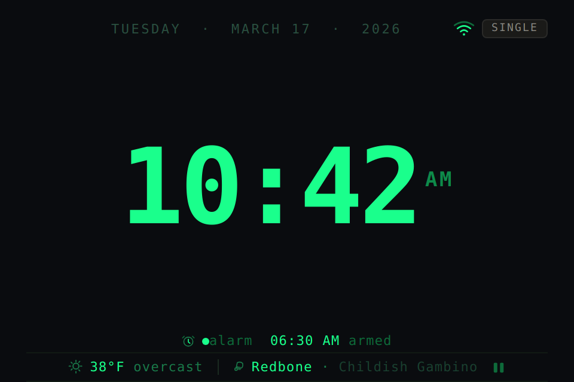 | 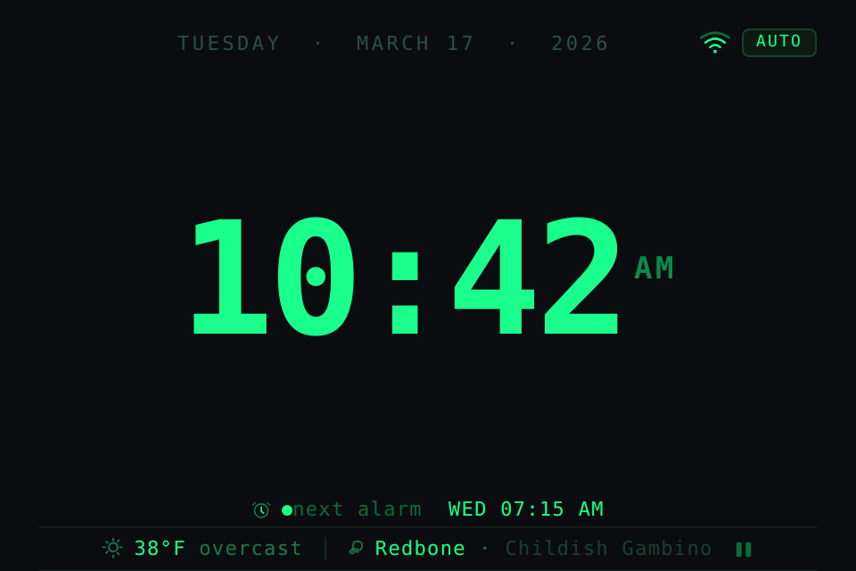 |

| Component | ID | Slot / State |
|-----------|----|-------------|
| **TopBar** | C01 | Date · WiFi · ModeBadge (SINGLE grey / AUTO green) |
| **CPHeader** | C02a | nil — hidden |
| **CPBody** | C02b | C03 ClockDisplay, blink: off — live RTC time |
| **CPWidget** | C02c | nil |
| **CPFooter** | C02d | Alarm variant — icon + dot + `'alarm HH:MM'` or `'next alarm DAY HH:MM'` |
| **BottomBar** | C04 | C06 StatusStrip |

### 5.2 Edit Clock Time

Entered by pressing TIME. Press TIME again to confirm. HR+ and MIN+ adjust the time. Entire clock blinks.

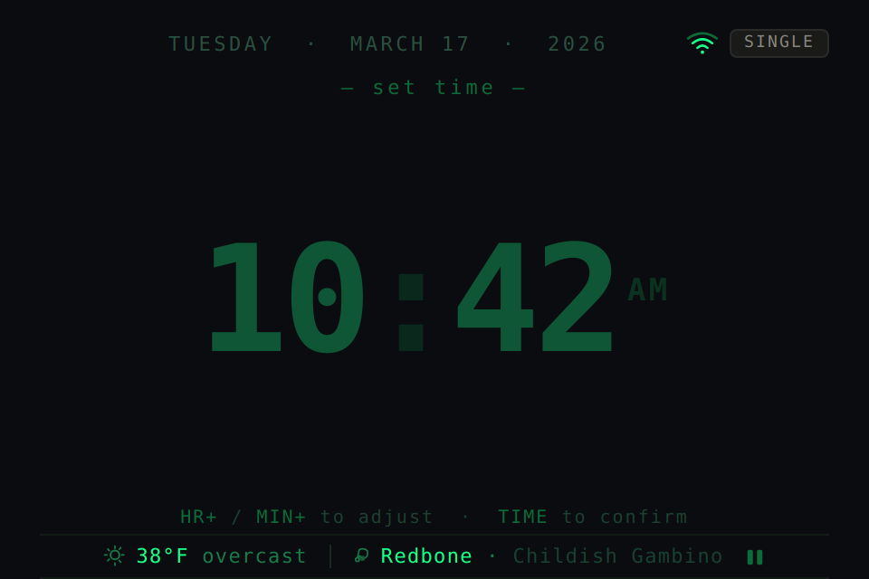

| Component | ID | Slot / State |
|-----------|----|-------------|
| **CPHeader** | C02a | `'— set time —'` (normal style) |
| **CPBody** | C02b | C03 ClockDisplay, blink: on |
| **CPWidget** | C02c | nil |
| **CPFooter** | C02d | Hint: `'HR+ / MIN+ to adjust · TIME to confirm'` |

### 5.3 Set Alarm — Single Mode

Entered by pressing SET in SINGLE mode. Press SET again to confirm.

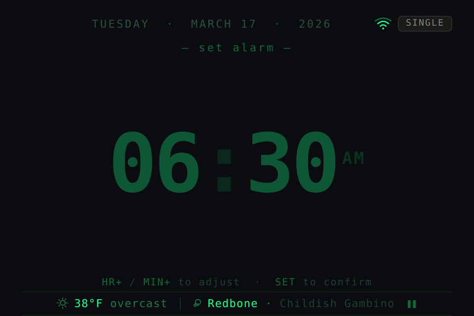

| Component | ID | Slot / State |
|-----------|----|-------------|
| **CPHeader** | C02a | `'— set alarm —'` (normal style) |
| **CPBody** | C02b | C03 ClockDisplay, blink: on |
| **CPWidget** | C02c | nil |
| **CPFooter** | C02d | Hint: `'HR+ / MIN+ to adjust · SET to confirm'` |

### 5.4 Set Alarm — Auto Mode

Entered by pressing SET in AUTO mode. Defaults to Monday. Press a different day button to switch. Press the currently selected day button to toggle it armed/disarmed.

| Armed state (● = alarm on) | Disarmed state (○ = alarm off) |
|---|---|
| 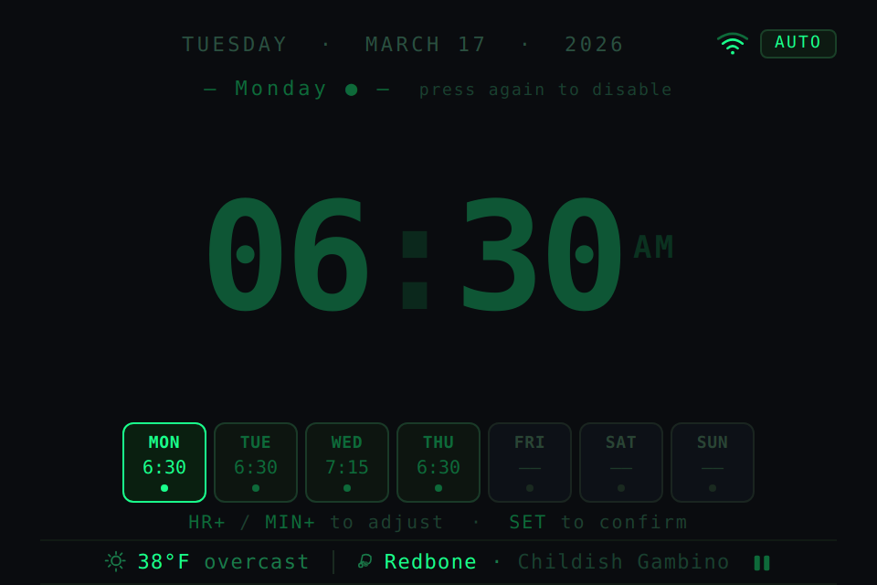 | 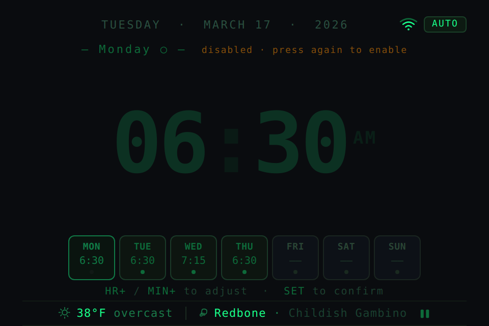 |

| Component | ID | Slot / State |
|-----------|----|-------------|
| **CPHeader** | C02a | `'— {Day} ● —'` armed, or `'— {Day} ○ —'` disarmed + hint suffix |
| **CPBody** | C02b | C03 ClockDisplay, blink: on (very dim when day is disarmed) |
| **CPWidget** | C02c | C05 DayRow — activeDay = MON on entry; selected tile reflects arm state |
| **CPFooter** | C02d | Hint: `'HR+ / MIN+ to adjust · SET to confirm'` |

> Pressing the currently selected day button toggles its armed state. The header indicator and tile pip update immediately. HR+/MIN+ still adjust the time even when disabled — the time is preserved so re-enabling it restores the previous value.

### 5.5 Alarm Firing

When a firing condition is met. Clock shows the alarm time. No day label. Rings until DISMISS.

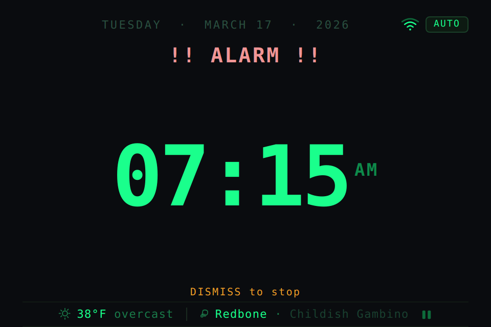

| Component | ID | Slot / State |
|-----------|----|-------------|
| **CPHeader** | C02a | `'!! ALARM !!'` (alert style — DejaVu Sans Mono Bold, `#F09595`) |
| **CPBody** | C02b | C03 ClockDisplay, blink: off — shows firing alarm time |
| **CPWidget** | C02c | nil |
| **CPFooter** | C02d | Dismiss variant: `'DISMISS to stop'` in `#EF9F27` |

---

## 6. State Machine

Every state, trigger, resulting state, and action. The MODE switch is ambient context — not a state transition.

| State | Trigger | Next State | Action / Notes |
|-------|---------|-----------|----------------|
| IDLE | TIME | EDIT_CLOCK | Enter clock edit; begin blinking full display |
| IDLE | SET (SINGLE mode) | SET_SINGLE | Show alarm editor; begin blinking |
| IDLE | SET (AUTO mode) | SET_AUTO_EDIT | Open on Monday by default; show DayRow; begin blinking |
| IDLE | MODE switch flipped | IDLE | Update ModeBadge; re-evaluate next alarm |
| IDLE | Alarm time reached + armed | FIRING | Play alarm tone; show alert screen |
| EDIT_CLOCK | HR+ | EDIT_CLOCK | Increment hour; wrap 12→1 |
| EDIT_CLOCK | MIN+ | EDIT_CLOCK | Increment minute; wrap 59→0 |
| EDIT_CLOCK | TIME | IDLE | Commit new clock time; stop blink |
| SET_SINGLE | HR+ | SET_SINGLE | Increment alarm hour; wrap 12→1 |
| SET_SINGLE | MIN+ | SET_SINGLE | Increment alarm minute; wrap 59→0 |
| SET_SINGLE | SET | IDLE | Save alarm time; return to idle |
| SET_AUTO_EDIT | Day button (other) | SET_AUTO_EDIT | Switch active day; update header + DayRow |
| SET_AUTO_EDIT | Day button (current) | SET_AUTO_EDIT | Toggle arm/disarm for active day; update header indicator + pip |
| SET_AUTO_EDIT | HR+ | SET_AUTO_EDIT | Increment alarm hour for active day |
| SET_AUTO_EDIT | MIN+ | SET_AUTO_EDIT | Increment alarm minute for active day |
| SET_AUTO_EDIT | SET | IDLE | Save active day; return to idle |
| FIRING | DISMISS | IDLE | Stop alarm tone; clear alert screen |

### 6.1 Mode Switch Behaviour

- **SINGLE:** TIME edits clock. SET edits the one global alarm. Day buttons inert.
- **AUTO:** TIME edits clock. SET opens alarm editor on Monday. Day buttons navigate and toggle arm state.
- If MODE switch is flipped mid-edit, the flow cancels and returns to IDLE.

### 6.2 Alarm Armed Logic

- **SINGLE:** armed when a time is set and alarm switch is ON.
- **AUTO:** each day has an independent armed flag. Toggled by pressing the selected day button. A disarmed day retains its time — re-arming restores it.
- The next alarm footer always shows the nearest upcoming armed slot across all active days.
- There is no auto-dismiss. The alarm rings until DISMISS is pressed.

### 6.3 Long-press TIME — AM/PM Toggle

In all edit states (EDIT_CLOCK, SET_SINGLE, SET_AUTO_EDIT): a long-press of the TIME button (≥800 ms) toggles AM/PM. The 17px superscript label updates live. Short-press TIME still confirms and exits the edit state as normal.

---

## 7. Component Reuse Matrix

Green dot = component present on that screen. C02b and C03 are present on every screen — the clock never disappears.

| ID | Component | IDLE | EDIT CLOCK | SET SINGLE | SET_AUTO_EDIT | FIRING |
|----|-----------|:----:|:----------:|:----------:|:-------------:|:------:|
| C01 | TopBar | ● | ● | ● | ● | ● |
| C02 | ContentPanel | ● | ● | ● | ● | ● |
| C02a | ↳ CPHeader | | ● | ● | ● | ● |
| C02b | ↳ CPBody | ● | ● | ● | ● | ● |
| C02c | ↳ CPWidget | | | | ● | |
| C02d | ↳ CPFooter | ● | ● | ● | ● | ● |
| C03 | ClockDisplay | ● | ● | ● | ● | ● |
| C04 | BottomBar | ● | ● | ● | ● | ● |
| C05 | DayRow | | | | ● | |
| C05a | ↳ DayTile ×7 | | | | ● | |
| C06 | StatusStrip | ● | ● | ● | ● | ● |
| C07 | DateLabel | ● | ● | ● | ● | ● |
| C08 | ModeBadge | ● | ● | ● | ● | ● |
| C09 | WiFiIndicator | ● | ● | ● | ● | ● |

---

## Appendix · Component Renders & Dimensions

Each component rendered at 2× resolution showing all visual states. Dimension tables specify exact pixel values for 480×320 px target. No additional effects (shadow, gradient, glow) beyond what is shown.

### C01 · TopBar

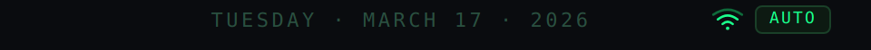

| Property | Value |
|----------|-------|
| Width × Height | 480 × 28 px |
| Background | `#0A0C0F` |
| Padding | horizontal sides: 22px · vertical: centered |
| Layout | flex row · space-between |
| Left spacer | 28px fixed (balances wifi+badge group on right) |
| C07 DateLabel | flex:1 · centered · DejaVu Sans Mono 11px · `#2A5040` · tracking 0.16em · uppercase |
| C09 WiFiIndicator | 18×14px · inner arcs `#1AFF8C` · outer arc `#0E6A3A` |
| C08 ModeBadge | DejaVu Sans Mono 9px · border-radius 4px · see below |

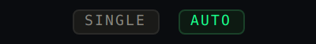

| ModeBadge state | Values |
|-----------------|--------|
| SINGLE | text `#888780` · bg `#1A1A18` · border 0.5px `#2A2A28` |
| AUTO | text `#1AFF8C` · bg `#0D1A12` · border 0.5px `#1A4028` |
| Padding | 2px vertical · 7px horizontal |

### C03 · ClockDisplay — Idle and Edit

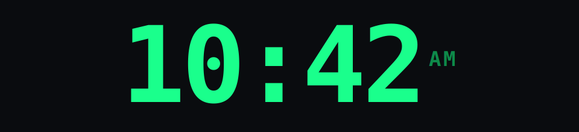

*↑ Idle (blink off)*

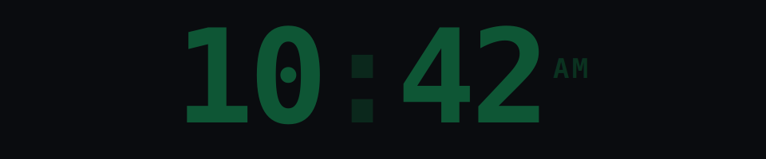

*↑ Edit / Firing (blink on — shown at 25% opacity phase)*

| State | Font · Size · Color · Notes |
|-------|------------------------------|
| Idle | DejaVu Sans Mono Bold · 88px · `#1AFF8C` · tracking −3px · colon `#0E6A3A` |
| Edit / Firing | DejaVu Sans Mono Bold · 82px · `#1AFF8C` · `lv_obj` opacity toggles 1.0↔0.25 at 500ms |
| AM/PM (both) | DejaVu Sans Mono Bold · 17px · `#0E8A4A` · vertical-align super · margin-left 5px |
| Long-press TIME | ≥800ms in any edit state → toggles AM/PM live |

### C02a · ContentPanelHeader — All Variants

Hidden (`LV_OBJ_FLAG_HIDDEN`) on idle screens. Three style variants.

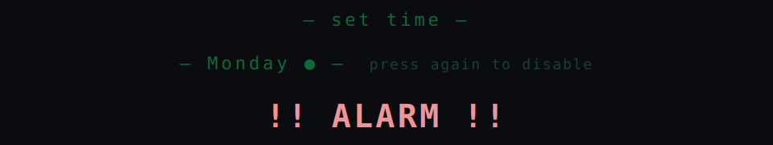

| Variant | Font · Color · Notes |
|---------|----------------------|
| Normal (edit) | DejaVu Sans Mono 11px · `#0E6A3A` · tracking 0.18em · centered · padding 4px top 2px bot |
| Auto edit armed | Normal + `' ● '` (U+25CF, `#1AFF8C`) after day name · hint suffix `#1A4030` |
| Auto edit disarmed | Normal + `' ○ '` (U+25CB, `#1AFF8C`) after day name · hint suffix `#854F0B` |
| Alert (FIRING) | DejaVu Sans Mono Bold 20px · `#F09595` · tracking 0.08em · centered |

### C02d · ContentPanelFooter — All Variants

Never hidden. Content and color change per screen context.

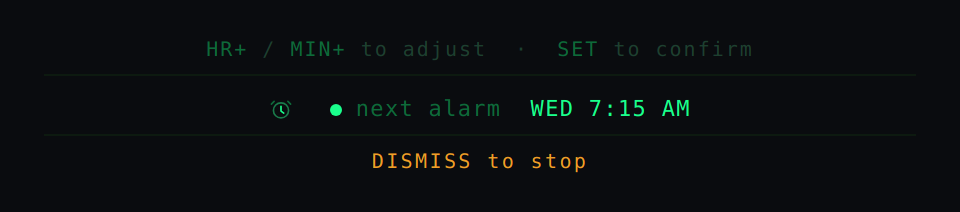

| Variant | Spec |
|---------|------|
| Hint (edit screens) | DejaVu Sans Mono 10px · `#1E4030` · centered · HR+/MIN+/SET/TIME keywords in `#0E6A3A` |
| Alarm — SINGLE | `'alarm H:MM AM armed'` · 11px · label `#1A7A4A` · time `#1AFF8C` · armed dot 6×6px `#1AFF8C` |
| Alarm — AUTO | `'next alarm DAY H:MM AM'` · same styling · 3-char uppercase day |
| No alarm set | `LV_OBJ_FLAG_HIDDEN` — footer not shown when no alarm is configured |
| Dismiss (FIRING) | `'DISMISS to stop'` · 11px · `#EF9F27` · tracking 0.12em · centered · no border |
| Padding | 4px top · 3px bottom |

### C05 · DayRow + C05a · DayTile — All States

Left-to-right: default · has-alarm · selected-armed · selected-disarmed · has-alarm · default · default.

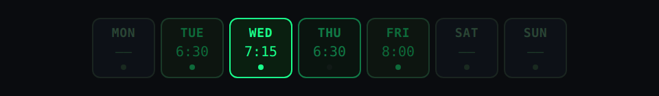

| Property | Value |
|----------|-------|
| DayRow | flex row · gap 4px · justify-content: center · padding 6px top 4px bottom |
| DayTile size | min-width 46px · border-radius 6px · padding 6px top/bottom · 6px left/right |
| Day label | DejaVu Sans Mono 9px · uppercase |
| Time | DejaVu Sans Mono 10px · `'H:MM'` or `'——'` (U+2014 ×2) if unset |
| Pip | 4×4px circle · bottom-center |
| default | bg `#0D1117` · border 0.5px `#1A2520` · label `#2A4535` · time `#1E3A2A` · pip `#1A2A20` |
| has-alarm | bg `#0D1510` · border 0.5px `#1A3A28` · label/time/pip `#0E6A3A` |
| selected — armed | bg `#0A1F10` · border 0.5px `#1AFF8C` · label/time/pip `#1AFF8C` · clock blinks |
| selected — disarmed | Same as armed · `lv_obj` opacity 45% · pip `#1A2A20` |

### C06 · StatusStrip

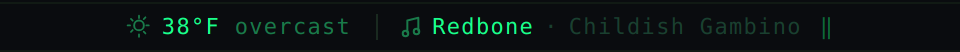

| Property | Value |
|----------|-------|
| Width × Height | 480 × 26px |
| Borders | 0.5px solid `#111A14` top and bottom |
| Divider | 0.5px solid `#1A2A20` · height 13px · vertically centered |
| Padding per item | 12px horizontal |
| Weather | ☀ icon 13×13px · temp 11px `#1AFF8C` · condition `#1A7A4A` |
| Now playing | ♫ icon 11×11px · track 11px `#1AFF8C` · `'·'` · artist `#1A4030` · ‖ pause 12×12px |
| Truncation | `…` (U+2026) if track or artist exceeds ~140px at 11px |
